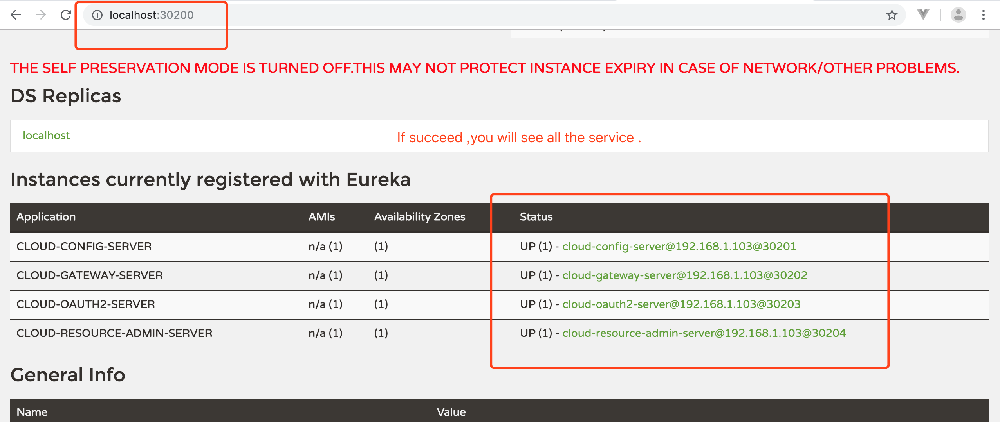

# micro-service-framework
micro service framework , springcloud gateway , Eureka Server , Config Server , Oauth2 Server , Resource Server , Zipkin , Turbin , JPA .  And Support CI/CD

# How to run  
## create database
```  
for example  mysql  
CREATE DATABASE IF NOT EXISTS oauth2-server DEFAULT CHARSET utf8 COLLATE utf8_general_ci;
```
## init database  
```
INSERT INTO oauth_client_entity (id, client_id, application_name, client_secret, authorized_grant_types, authorities,
                                 scope, web_server_redirect_uri, access_token_validity, refresh_token_validity, remarks)
VALUES (1, 'SampleClientId', 'SampleClientId 测试应用', '$2a$10$gcrWom7ubcRaVD1.6ZIrIeJP0mtPLH5J9V/.8Qth59lZ4B/5HMq96',
        'authorization_code,refresh_token,password', 'ROLE_TRUSTED_CLIENT', 'user_info',
        'http://client.sso.com/login/oauth2/code/sso-login', 3600, 2592000, '测试明文:tgb.258');

INSERT INTO scope_definition_entity (id, scope, definition)
values (1, 'user_info', '昵称、头像、性别信息');

insert into role_entity(id, role_name)
values (1, 'ROLE_SUPER'),
       (2, 'ROLE_ADMIN'),
       (3, 'ROLE_USER');

INSERT INTO user_account_entity (id, username, password, account_open_code, nick_name, remarks)
VALUES (1, 'zhangsan', '$2a$10$gcrWom7ubcRaVD1.6ZIrIeJP0mtPLH5J9V/.8Qth59lZ4B/5HMq96', '1', '张三', '测试明文:tgb.258'),
       (3, 'lisi', '$2a$10$gcrWom7ubcRaVD1.6ZIrIeJP0mtPLH5J9V/.8Qth59lZ4B/5HMq96', '3', '李四', '测试明文:tgb.258');

insert into user_account_entity_roles(user_id, role_id)
values (1, 1),
       (3, 3);

       # init  sample data


       # 序列号
       CREATE TABLE IF NOT EXISTS sequence_entity
       (
           id            BIGINT AUTO_INCREMENT PRIMARY KEY NOT NULL,
           sequence_name VARCHAR(50) COMMENT 'key值',
           current_value BIGINT    DEFAULT 1               NOT NULL
               COMMENT '当前值',
           version       INT       DEFAULT 0               NOT NULL,
           record_status INT       DEFAULT 0               NOT NULL,
           sort_priority INT       DEFAULT 0,
           remark        VARCHAR(255),
           date_created  TIMESTAMP DEFAULT CURRENT_TIMESTAMP,
           last_modified TIMESTAMP DEFAULT CURRENT_TIMESTAMP ON UPDATE CURRENT_TIMESTAMP,
           CONSTRAINT unique_sequence_name UNIQUE (sequence_name)
       );

       # 资源表-角色表
       CREATE TABLE IF NOT EXISTS resource_entity
       (
           id            BIGINT AUTO_INCREMENT PRIMARY KEY NOT NULL,
           url           VARCHAR(50)                       NOT NULL COMMENT 'url资源',
           roles         VARCHAR(50)                       NOT NULL COMMENT '该资源此类角色可访问',
           version       INT       DEFAULT 0               NOT NULL,
           record_status INT       DEFAULT 0               NOT NULL,
           sort_priority INT       DEFAULT 0,
           remark        VARCHAR(255),
           date_created  TIMESTAMP DEFAULT CURRENT_TIMESTAMP,
           last_modified TIMESTAMP DEFAULT CURRENT_TIMESTAMP ON UPDATE CURRENT_TIMESTAMP,
           CONSTRAINT unique_url UNIQUE (url)
       );

       insert into resource_entity(url, roles)
       values ('/admin/user/**', 'ROLE_SUPER'),
              ('/admin/role/**', 'ROLE_SUPER'),
              ('/case/**', 'ROLE_USER,ROLE_SUPER');
```

## to start microservice
cd common  
mvn install  

cd mybusiness-spring-boot-starter  
mvn install  

cd eureka  
mvn spring-boot:run   
or   
mvn spring-boot:run  -Dspring-boot.run.mArguments="-Dserver.port=30200 -Xms128m -Xmx128m"  

cd config  
mvn spring-boot:run   
or   
mvn spring-boot:run  -Dspring-boot.run.mArguments="-Dserver.port=30201 -Xms128m -Xmx128m"  

cd gateway  
mvn spring-boot:run  
or  
mvn spring-boot:run  -Dspring-boot.run.mArguments="-Dserver.port=30202 -Xms256m -Xmx256m"  


cd oauth2-server  
mvn spring-boot:run  
or  
mvn spring-boot:run  -Dspring-boot.run.mArguments="-Dserver.port=30203 -Xms256m -Xmx256m"  


cd resource-admin    
mvn spring-boot:run  
or   
mvn spring-boot:run  -Dspring-boot.run.mArguments="-Dserver.port=30204 -Xms256m -Xmx256m"  


## test  
microservice status , visit the flowing address    
http://localhost:30200  

get token from oauth2  
```
curl   SampleClientId:tgb.258@localhost:30204/auth/oauth/getToken -d grant_type=password -d username=zhangsan -d password=tgb.258
```

  
                                **figure contrainer deployment**   
